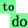
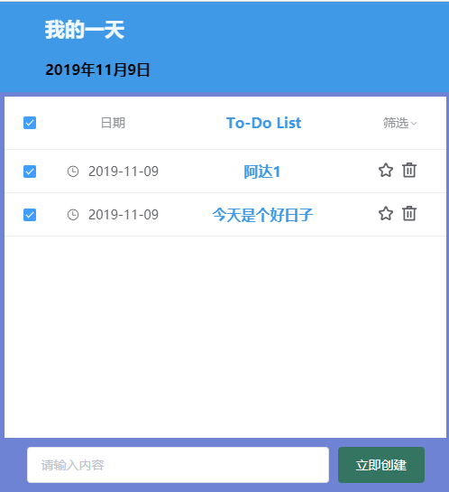
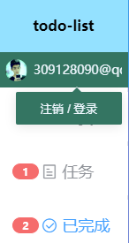
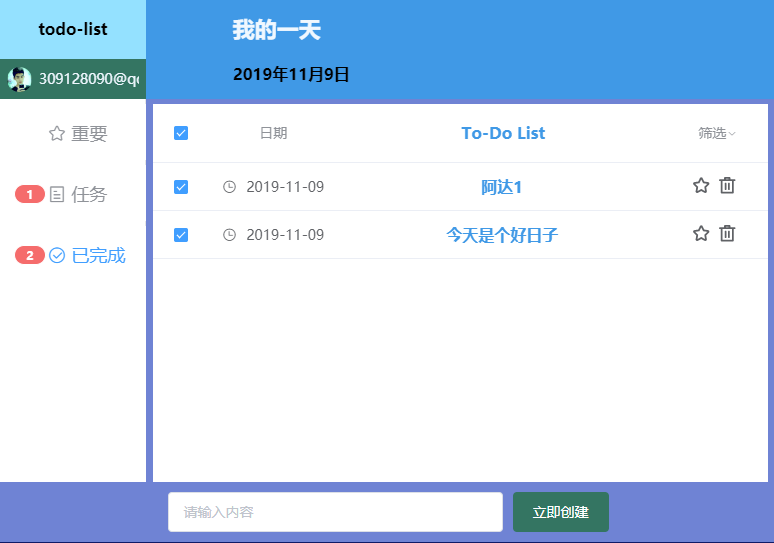

# 
# vue-todoList
 
## demo
<div align="center">



</div>

### server.js: node + express + mongoose + gravatar

### clint: vue + element-ui + axios + momentjs

### 数据修改重载
  ``` js
  updated() {
    this.toggleSelection(
      this.currentlyList.filter(item => {
        return item.done === true;
      })
    );
  }
  ```